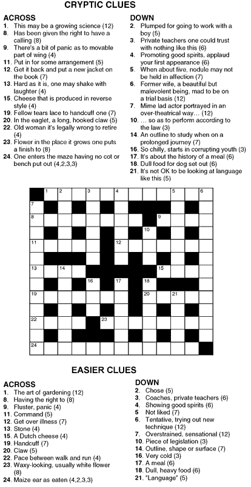
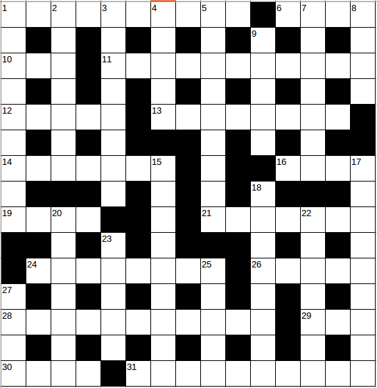

xwbinarier
==========

Extract a matrix of binary values (white and black shaded squares) from crossword image

Use brew to [Install OpenCV on Mac OS X Mavericks](https://jjyap.wordpress.com/2014/05/24/installing-opencv-2-4-9-on-mac-osx-with-python-support/). There is also explained how to link OpenCV and Python.

Code was taken from ["Crossword digitization using image processing" in StackOverflow](http://stackoverflow.com/questions/16975556/crossword-digitization-using-image-processing)

This is a sample image file:

Run program:

    python main.py
  
We will get this matrix:

    [[ 0.  1.  1.  1.  1.  1.  1.  1.  1.  1.  1.  1.  1.]
     [ 1.  0.  1.  0.  1.  0.  1.  0.  0.  0.  1.  0.  1.]
     [ 1.  1.  1.  1.  1.  1.  1.  1.  0.  1.  1.  1.  1.]
     [ 1.  0.  1.  0.  1.  0.  1.  0.  1.  0.  1.  0.  1.]
     [ 1.  1.  1.  1.  1.  0.  1.  1.  1.  1.  1.  1.  1.]
     [ 1.  0.  0.  0.  1.  0.  1.  0.  1.  0.  1.  0.  1.]
     [ 1.  1.  1.  1.  0.  0.  0.  0.  0.  1.  1.  1.  1.]
     [ 1.  0.  1.  0.  1.  0.  1.  0.  1.  0.  0.  0.  1.]
     [ 1.  1.  1.  1.  1.  1.  1.  0.  1.  1.  1.  1.  1.]
     [ 1.  0.  1.  0.  1.  0.  1.  0.  1.  0.  1.  0.  1.]
     [ 1.  1.  1.  1.  0.  1.  1.  1.  1.  1.  1.  1.  1.]
     [ 1.  0.  1.  0.  0.  0.  1.  0.  1.  0.  1.  0.  1.]
     [ 1.  1.  1.  1.  1.  1.  1.  1.  1.  1.  1.  1.  0.]]

- 0s for black shaded squares
- 1s for white squares

# 15x15 Crossword

Let's consider a different grid. [Crucigrama 6 taken from elcriptico.com](http://elcriptico.com/crucigrama-6/)

In code, we will need to read this file

    img = cv2.imread('crucigrama6.png')

Adjustment to rows and cols variables will be needed

    rows = 15
    cols = 15

After running python script, we will get the following array:

    [[ 1.  1.  1.  1.  1.  1.  1.  1.  1.  1.  0.  1.  1.  1.  1.]
     [ 1.  0.  1.  0.  1.  0.  1.  0.  1.  0.  1.  0.  1.  0.  1.]
     [ 1.  1.  1.  0.  1.  1.  1.  1.  1.  1.  1.  1.  1.  1.  1.]
     [ 1.  0.  1.  0.  1.  0.  1.  0.  1.  0.  1.  0.  1.  0.  1.]
     [ 1.  1.  1.  1.  1.  0.  1.  1.  1.  1.  1.  1.  1.  1.  0.]
     [ 1.  0.  1.  0.  1.  0.  0.  0.  1.  0.  1.  0.  1.  0.  0.]
     [ 1.  1.  1.  1.  1.  1.  1.  0.  1.  0.  0.  1.  1.  1.  1.]
     [ 1.  0.  0.  0.  1.  0.  1.  0.  1.  0.  1.  0.  0.  0.  1.]
     [ 1.  1.  1.  1.  0.  0.  1.  0.  1.  1.  1.  1.  1.  1.  1.]
     [ 0.  0.  1.  0.  1.  0.  1.  0.  0.  0.  1.  0.  1.  0.  1.]
     [ 0.  1.  1.  1.  1.  1.  1.  1.  1.  0.  1.  1.  1.  1.  1.]
     [ 1.  0.  1.  0.  1.  0.  1.  0.  1.  0.  1.  0.  1.  0.  1.]
     [ 1.  1.  1.  1.  1.  1.  1.  1.  1.  1.  1.  0.  1.  1.  1.]
     [ 1.  0.  1.  0.  1.  0.  1.  0.  1.  0.  1.  0.  1.  0.  1.]
     [ 1.  1.  1.  1.  0.  1.  1.  1.  1.  1.  1.  1.  1.  1.  1.]]
